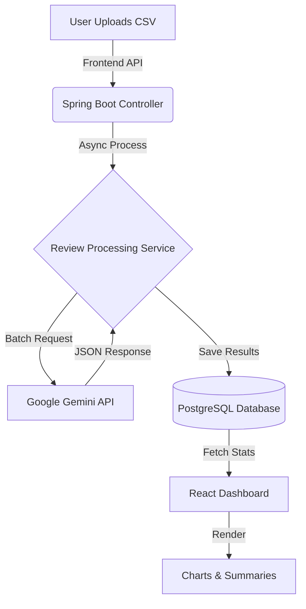
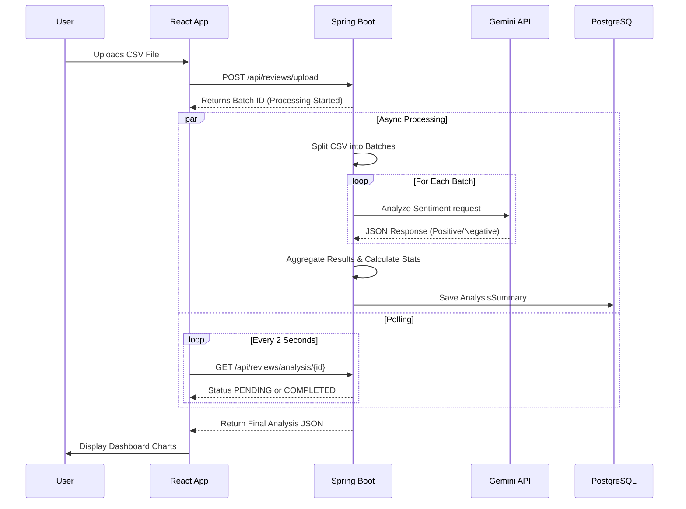

# 📊 AI Review Insights Dashboard

> **Transform raw customer feedback into actionable insights with AI-powered sentiment analysis.**


## 🚀 Overview
The **AI Review Insights Dashboard** is a full-stack application that processes customer reviews using **Google's Gemini AI**. It automatically classifies sentiment (Positive, Neutral, Negative), extracts key Pros & Cons, and visualizes the data in an interactive dashboard.

## ✨ Features
- **📂 Bulk CSV Upload**: Drag-and-drop support for analyzing large datasets of reviews.
- **🧠 AI Sentiment Analysis**: Uses Google Gemini Pro/Flash to understand context and nuance.
- **🔍 Smart Summarization**: Automatically extracts top 5 key strengths (Pros) and weaknesses (Cons).
- **📈 Interactive Visualizations**: Beautiful charts for sentiment distribution and confidence metrics.
- **⚡ Real-time Processing**: Fast, asynchronous processing of review batches.

## 🔄 How It Works
1.  **Upload**: User drags & drops a CSV file containing product reviews.
2.  **Processing**: The backend splits the file into manageable chunks.
3.  **AI Analysis**: Each chunk is sent to **Google Gemini AI**, which:
    *   Determines if the review is Positive, Neutral, or Negative.
    *   Extracts specific Pros (e.g., "Battery life") and Cons (e.g., "Expensive").
4.  **Aggregation**: The results are aggregated to calculate overall percentages.
5.  **Visualization**: The frontend fetches these stats and renders:
    *   A Pie Chart (Sentiment Distribution).
    *   A Bar Chart (Sentiment Confidence).
    *   Lists of Top Pros & Cons.

### Workflow Diagram


## 🏗️ System Architecture
This project follows a modern **Monolithic Architecture** with a clear separation of concerns:

### 1. Client-Side (Frontend) 💻
*   **React.js**: Handles the UI and user interactions.
*   **File Upload**: Reads CSV files and sends them as `MultipartFile` to the backend.
*   **Polling Mechanism**: Since AI processing takes time, the frontend polls the backend every few seconds to check if the analysis is ready.

### 2. Server-Side (Backend) ⚙️
*   **Spring Boot Controller**: Exposes REST endpoints (`/upload`, `/analysis/{id}`).
*   **Async Processing**: Files are processed asynchronously using `@Async` to prevent blocking the main thread.
*   **Batching Strategy**: Large files are split into smaller chunks (batches of 10-20 reviews) to respect Gemini API limits.

### 3. AI Integration (Gemini) 🧠
*   **Prompt Engineering**: We use a structured prompt to force the AI to return strictly formatted JSON.
*   **Rate Limiting Handling**: The service includes retry logic (exponential backoff) to handle `429 Too Many Requests` errors gracefully.

### 4. Database Layer (PostgreSQL) 🗄️
*   **JPA Entities**: Data is structured into `AnalysisSummary` tables.
*   **JSON Storage**: Complex data like 'Top Pros' and 'Top Cons' are serialized and stored as JSON strings for flexibility.

### 📜 Data Flow Sequence


## 🛠️ Tech Stack
### Frontend
- **React.js** (Create React App)
- **Material UI (MUI)** for premium, responsive design.
- **Recharts** for data visualization.
- **Axios** for API communication.

### Backend
- **Spring Boot 3** (Java 17+)
- **Spring Data JPA** & **PostgreSQL** for persistence.
- **Google Gemini API** for Generative AI.
- **Lombok** for cleaner code.
- **Maven** for build automation.

## ⚙️ Prerequisites
- **Java 17** or higher.
- **Node.js** (v16+) and npm.
- **PostgreSQL** installed and running.
- **Google Cloud API Key** with access to Gemini API.

## 🚀 Getting Started

### 1. Database Setup
Create a PostgreSQL database named `review_db`.
```sql
CREATE DATABASE review_db;
```

### 2. Backend Setup
1. Navigate to the backend folder:
   ```bash
   cd backend
   ```
2. Configure **Secrets**:
   Create a file `src/main/resources/application-secrets.properties` (this is git-ignored for security):
   ```properties
   spring.datasource.password=YOUR_DB_PASSWORD
   gemini.api.key=YOUR_GEMINI_API_KEY
   ```
3. Run the application:
   ```bash
   mvn spring-boot:run
   ```
   *The backend will start on `http://localhost:8080`*

### 3. Frontend Setup
1. Navigate to the frontend folder:
   ```bash
   cd frontend
   ```
2. Install dependencies:
   ```bash
   npm install
   ```
3. Start the development server:
   ```bash
   npm start
   ```
   *The app will open at `http://localhost:3000` (or 3001 if port is busy)*

## 📁 Project Structure
```
ai-review-insights-dashboard/
├── backend/                 # Spring Boot Application
│   ├── src/main/java/       # Source Code (Service, Controller, Entity)
│   └── src/main/resources/  # Config (application.properties)
├── frontend/                # React Application
│   ├── src/components/      # UI Components (Dashboard, Charts)
│   └── src/services/        # API Integration
└── README.md                # Project Documentation
```

## 🛡️ Security
- **API Keys & Passwords** are stored in `application-secrets.properties` and are **NOT** committed to version control.
- **.gitignore** is configured to exclude sensitive files and build artifacts.

## 🤝 Contributing
1. Fork the repository.
2. Create your feature branch (`git checkout -b feature/AmazingFeature`).
3. Commit your changes (`git commit -m 'Add some AmazingFeature'`).
4. Push to the branch (`git push origin feature/AmazingFeature`).
5. Open a Pull Request.

---
*Built with ❤️ by Sumit Jha*